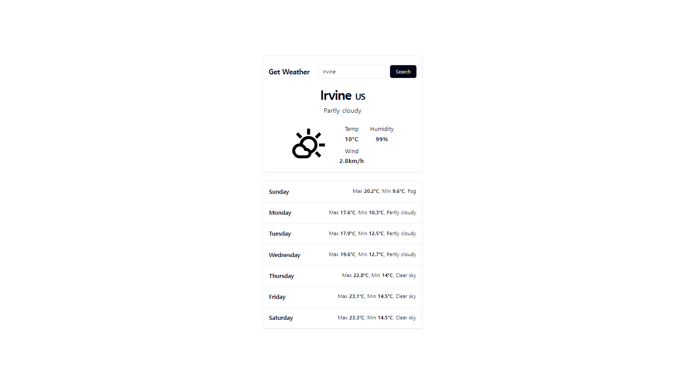
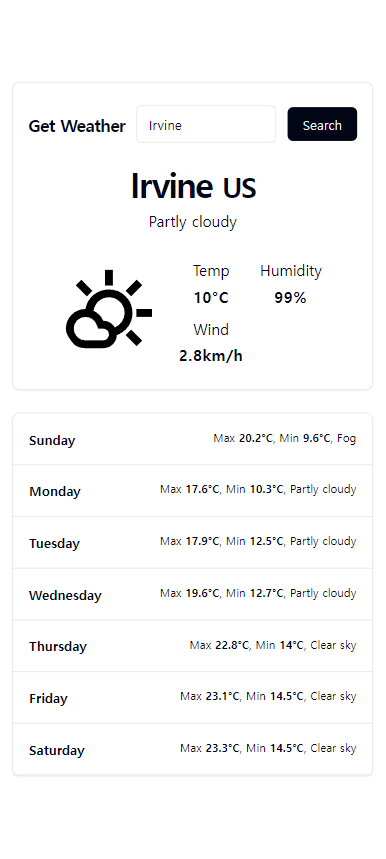

# Get Weather

Weather forecast web application.
 
Please take a moment to try this web application [here](https://yskim-get-weather.vercel.app/).

## How to Use

Type the name of the city on the search bar to get the weather information. Current weather information such as temperature, humidity, and wind speed will be displayed on the upper-half of the screen, and weather information of upcoming days with maximum and minimum temperature will be displayed on the lower-half of the screen.

## Skills

- React
- Typescript
- Node JS
- CSS
- Tailwind CSS
- Html

## Display Examples

### Desktop Display

### Galaxy S20 Ultra Display (412 x 915)

## Acknowledgement

This web application is developed with React using Vite environment.
 
This web application is deployed on [vercel](https://yskim-get-weather.vercel.app/).
 
The copyright of [Favicon](https://fonts.google.com/icons?selected=Material+Symbols+Outlined:thermostat:FILL@0;wght@400;GRAD@0;opsz@24&icon.query=forecast) used in this web application belongs to Google.
 
The copyright of [weather icons](https://fonts.google.com/icons?icon.query=weather) used in this web application belongs to Google.
 
The copyright of [block icon](https://fonts.google.com/icons?icon.query=block&selected=Material+Symbols+Outlined:block:FILL@0;wght@400;GRAD@0;opsz@24) used in this web application belongs to Google.

## Contact Info

- Name: Yeseong Kim
- Personal Email: mryesung1@gmail.com
- Public Email: yeseonk@uci.edu
- Phone: (+1) 949-836-1299

## Takeaways

- Crafted a user-friendly display by integrating loader components during data fetching
- Utilized Tailwind CSS to expedite the creation of well-organized designs
- Engineered custom React hooks to enhance code cleanliness within React components and facilitate reusability across future projects
